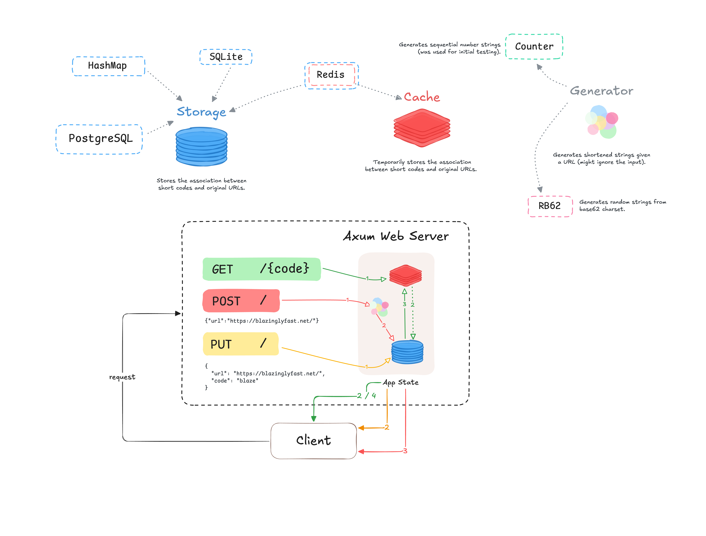

# Shrink

A URL Shortener built for [blazinglyfast.net](https://blazinglyfast.net/).

## Design



## Starting (URL Shortener) Shrink Server

### Launch a Redis Instance

Redis is used for caching. The current binary depends on Redis, although the program is customizable to opt out of cachine.

Install `redis-server` if not present and run it.

```console
redis-server
```

### Run the Rust Server Binary

```console
cargo run --release
```

## Shortening URLs

Bash Scripts under `./scripts` can be used to interact with the running server.

```bash
./scripts/shrink.sh https://blazinglyfast.net/
# {"shrunk":"http://localhost:3000/hWU7Xgc"}
```

### Custom Alias for a URL

```bash
./scripts/alias.sh blaze https://blazinglyfast.net/
# {"shrunk":"http://localhost:3000/blaze"}
```
